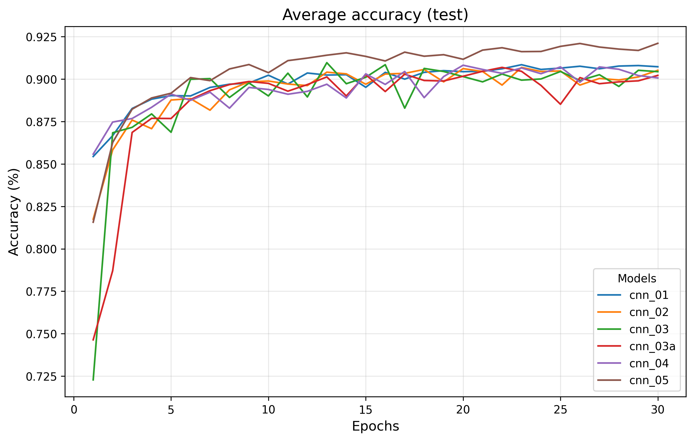

An **unoptimized** implementation of convolutional neural network, made from
scratch (well technically it does have dependencies but they're pre-installed)
in CUDA/C++.

Don't mind the crappy commit history, I just don't have NVIDIA graphic cards
to test it locally.

## How to build

GPU hardware that supports CUDA compiler (nvcc) version 12 or above is required.
Other dependencies include Thrust and cuRAND libraries (which are probably
shipped along with the compiler).

```bash
git clone --branch stable https://github.com/ceilight/cudaranai.git
cd cudaranai
mkdir build
cd build
cmake .. -DCMAKE_BUILD_TYPE=Release
make
```

## Demo

Table below documents the result of training different classifiers on
[Fashion-MNIST](https://github.com/zalandoresearch/fashion-mnist) dataset after
30 epochs. Test accuracy may differ due to batch size, random seed for weight
initialization, etc.

| Classifier | Optimizer | Run time | Max. test accuracy | Avg. test accuracy of the last 5 epochs |
| --- | --- | --- | --- | --- |
| 2 Conv + 1 FC (~11k params) | Adam | 68s | 0.9085 | 0.9073 |
| 2 Conv + 3 FC (~62k params) | SGD | 84s | 0.9069 | 0.9006 |
| 3 Conv + 2 FC (~193k params) | RMSProp | 150s | 0.9097 | 0.9014 |
| 3 Conv + 2 FC (~193k params) + Dropout | RMSProp | 155s | 0.9069 | 0.8996 |
| 3 Conv + 3 FC (~644k params) + Dropout | Adam | 361s | 0.9082 | 0.9028 |
| 2 Conv + 2 FC (~3.27M params) + Dropout | SGD | 363s | 0.9211 | 0.9191 |

Test accuracy progression



Refer to this [notebook](https://colab.research.google.com/drive/1PTEictwtufbPmYrmPti-UT2d56daOq6B?usp=sharing)
for full demonstration of the training process.